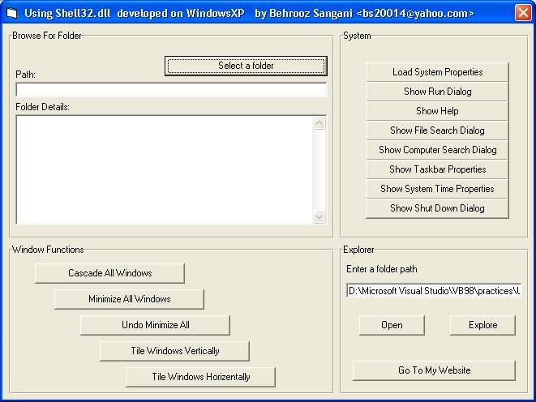



## A New Cool Way To Load Browse For Folder Dialog\(Updated\)

### Description

Remember the old one page module to load Browse For Folder!? This code makes it in four or five lines :) Just a reference to shell32.dll class:

dim SH as New Shell and that's all. In fact, shell32.dll supports many functions. I have included some of them such as tiling and cascading windows and running System Properties, getting folder details and.... Download the source code to see how and if you liked it please remember to leave comments and vote!

I developed this yesterday on my XP. If you have any idea, I'll be glad to know.

Update Note: I checked compatibility. This is supported in Win 98 etc.
 
### More Info
 

             |
---                |---
**Submitted On**   |2002-04-06 00:59:40
**By**             |[Behrooz Sangani](https://github.com/Planet-Source-Code/PSCIndex/blob/master/ByAuthor/behrooz-sangani.md)
**Level**          |Intermediate
**User Rating**    |4.8 (110 globes from 23 users)
**Compatibility**  |VB 6\.0
**Category**       |[Miscellaneous](https://github.com/Planet-Source-Code/PSCIndex/blob/master/ByCategory/miscellaneous__1-1.md)
**World**          |[Visual Basic](https://github.com/Planet-Source-Code/PSCIndex/blob/master/ByWorld/visual-basic.md)
**Archive File**   |[A\_New\_Cool69994482002\.zip](https://github.com/Planet-Source-Code/behrooz-sangani-a-new-cool-way-to-load-browse-for-folder-dialog-updated__1-33574/archive/master.zip)

